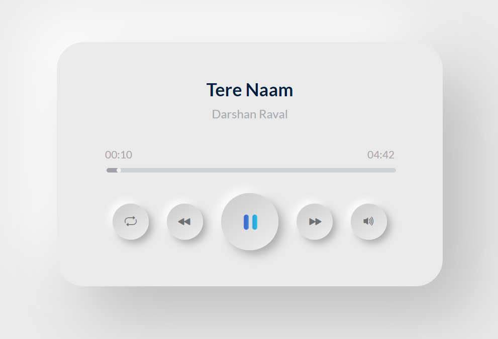

# Music Player

Music Player is a web application that allows users to play their favorite music tracks. It provides a user-friendly interface for managing playlists, searching for songs, and enjoying a personalized music listening experience.

## Features

- Play and pause music tracks.
- Shuffle and repeat playback options.
- Responsive design for seamless user experience across devices.

## Deployment

The Music Player web application is deployed and accessible at [https://musicplayerbyjais.netlify.app/](https://musicplayerbyjais.netlify.app/). Feel free to visit the link and start using the Music Player!
